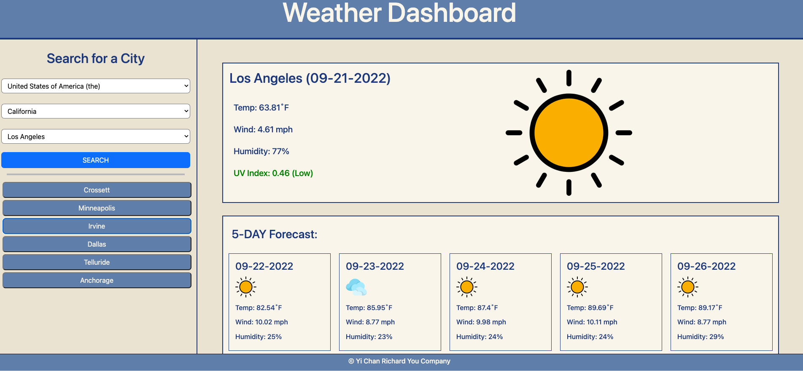

# Weather by city, search your trip's weather! 
## Main Contributor: Richard (Yi Chan) You

### [GitHub repository](https://github.com/YichanYouRichard/weather-by-city-find-your-trip)
### [GitHub deployed application](https://yichanyourichard.github.io/weather-by-city-find-your-trip/)

## Table of Contents
- [Project Description](#project-description)
- [Usage](#usage)
- [Question](#question)
- [Technology](#technology)
- [Final-Comment](#final-comment)

## Project-Description
- Project Motivation: The motivation of this project is to find weather of specific location that user wants to find, and not only today's weather, it allows users to search forecast weather for next 5 days.
- Why?: I build this project, to make user able to search the weather by cities of selections and also states, and later also countries
- Problems that were solved...: it solve that we can easily find the city to find weather
- What I learn...:From this project, I learned how to use API fetch request inorder to obtain the geological data depends on cities' name and weather information by inputing the lat and lon data. Also, I learned how to use both fetch request to make relational function by putting the data into local Storage temporarily

## Usage
Select the State, and select the cities depends on the state. if you click search the search history is comes upon below the search button, and you will able to see the weathers. You can click search history button inorder to go back the weather information user searched before.

## Question
Please ask any questions using the contact information below

- GitHub Username: [YiChanRichardYou](http://github.com/YiChanRichardYou)

- Contact Email: richardyou94@gmail.com
## Technology
- Bootstraps
 - CSS
 - JQuery
 - JavaScript
 - HTML
 ## Final-Comment

Thank you for reviewing my weather search project!